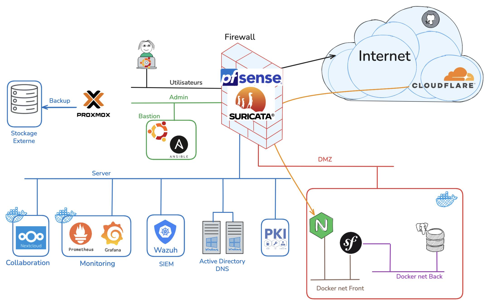

# 🐧 arcticpenguin

Projet final de formation qui illustre la conception et le déploiement d’une infrastructure complète, automatisée et sécurisée, combinant des outils de provisioning, de supervision et de CI/CD orientée sécurité.

L’objectif est de construire un environnement cohérent infra + services reposant sur Ansible pour l’automatisation, Docker pour la conteneurisation (webapp Symfony, monitoring, Nextcloud), et des briques de sécurité avancées (Wazuh, Cloudflare Tunnel, PKI).
​
## ⚠️ Note de sécurité
Ce repo contient des fichiers Ansible Vault pour un environnement de lab uniquement.
Les secrets ne sont pas utilisés en production.

## 📚 Documentation

- 🧱 Ansible (infra & services) : [ansible/README.md](ansible/README.md)
- ☁️ Nextcloud : [nextcloud/README.md](nextcloud/README.md)
- 📈 Monitoring : [monitoring/README.md](monitoring/README.md)
- 🌍 Webapp : [webapp/README.md](webapp/README.md)
- 🗺️ Schéma d’architecture : [docs/architecture.jpg](docs/architecture.jpg)

## 🧭 Contenu

**Ansible (infra & services)** : inventaire, variables, playbooks et rôles pour déployer un socle Linux + services (PKI Easy‑RSA, distribution de CA, monitoring, exporters, Cloudflare Tunnel, Nextcloud, Wazuh, webapp, Fail2ban).

**Webapp Symfony (Docker Compose)** : stack PHP-FPM + Nginx + PostgreSQL (compose, Dockerfile, conf Nginx, code Symfony).

**Monitoring (Docker Compose)** : Prometheus, Grafana, Alertmanager, Blackbox Exporter.

**Nextcloud (conteneur + config)** : docker-compose Nextcloud et fichiers de configuration (Apache + exemple LDAPS).

**Sécurité / PKI** : CA via Easy‑RSA, génération de certificats (LDAPS + certificats internes Nextcloud/Wazuh) et distribution de ca.crt sur les hôtes Linux.

**Wazuh** : configuration serveur (indexer/manager/dashboard) pour superviser de la sécurité sur l’ensemble des environnements Linux, Windows et Docker. Grâce à l’intégration de règles de détection avancées (brute force, escalade de privilèges, connexions distantes), la connexion avec VirusTotal pour l’analyse automatique des menaces et l'analyse des logs du firewall centralisé pfSense.

**CI sécurité** :

- 🧪 Semgrep (SAST) : scan statique du code (Symfony/PHP) + Docker/config pour détecter des patterns de vulnérabilités.
- 🧰 Trivy FS : scan du dépôt (vulnérabilités + mauvaises configurations), avec focus sur les niveaux `HIGH/CRITICAL`.
- 🕵️ TruffleHog : détection de secrets exposés (diff sur PR ou scan complet sur push), avec `--only-verified`.
- 📊 Les résultats Semgrep/Trivy sont publiés au format SARIF dans l’onglet **Security** de GitHub.

## 🎯 Périmètre

✅ Inclus : Ansible, stacks Docker (webapp, monitoring, nextcloud), Wazuh, PKI, Cloudflare Tunnel.  
❌ Hors scope : pfSense/Suricata, Proxmox, AD/DC, stockage/backup externe (présents sur le schéma uniquement).

## 🗺️ Architecture

Schéma d’architecture du projet (contexte réseau + services).

​Le schéma illustre notamment une exposition via Cloudflare Tunnel et une segmentation (Server/DMZ), avec une webapp derrière un reverse-proxy et une base de données sur un réseau “back”.

## 🗂️ Structure du dépôt

- [`ansible/`](ansible/) : automatisation infra (inventaire, variables, playbooks, rôles, collections).
- [`webapp/`](webapp/) : application Symfony + stack Docker (compose, Dockerfile, conf Nginx, code Symfony).
- [`monitoring/`](monitoring/) : stack de supervision Docker Compose + `.env.example`.
- [`nextcloud/`](nextcloud/) : stack Nextcloud (compose) + conf Apache + exemple LDAPS.
- [`docs/`](docs/) : documentation et ressources

## 🧩 Composants clés

- `Socle commun` : host, users, ssh_hardening, netplan, ufw_firewall, packages, node_exporter, process_exporter.
- [`easy_rsa`](ansible/roles/easy_rsa/) / [`easy_rsa_certs`](ansible/roles/easy_rsa_certs/) : PKI (CA) + génération de certificats LDAPS et internes (Nextcloud/Wazuh).
- [`distribute_ca`](ansible/roles/distribute_ca/)  : déploie `ca.crt` dans le trust store des hôtes Linux.
- [`cloudflare_tunnel`](ansible/roles/cloudflare_tunnel/) : installe/configure cloudflared et un service systemd (token via Vault).
- [`webapp`](ansible/roles/webapp/) : déploie la webapp Symfony via Docker Compose et génère les fichiers .env nécessaires (secrets via Vault).
- [`nextcloud`](ansible/roles/nextcloud/) : prépare la configuration Apache et LDAPS pour Nextcloud en conteneur.
- [`monitoring`](ansible/roles/monitoring/) : déploie la stack Prometheus/Grafana/Alertmanager/Blackbox en Docker Compose.
- [`wazuh_server_config`](ansible/roles/wazuh_server_config/) : déploie les configurations Wazuh (indexer/manager/dashboard) + rsyslog receiver.
- [`wazuh_client_config`](ansible/roles/wazuh_client_config/) : déploie une configuration de l'agent Wazuh.
- [`fail2ban`](ansible/roles/fail2ban/) : Fail2ban sur web01 avec filtres Nginx et action Cloudflare personnalisée.

## 🔐 Sécurité & secrets

Les secrets sont stockés via Ansible Vault (ex: group_vars/all/vault.yml, host_vars/*/vault.yml).
​
Exemples de secrets mentionnés : token Cloudflare (tunnel), token Cloudflare pour Fail2ban, secrets de webapp (APP_SECRET / credentials DB) et secrets Wazuh (cluster key, API key, mot de passe API dashboard).

## 📄 Licence

Projet de formation (lab). Licence : non définie (tous droits réservés).
